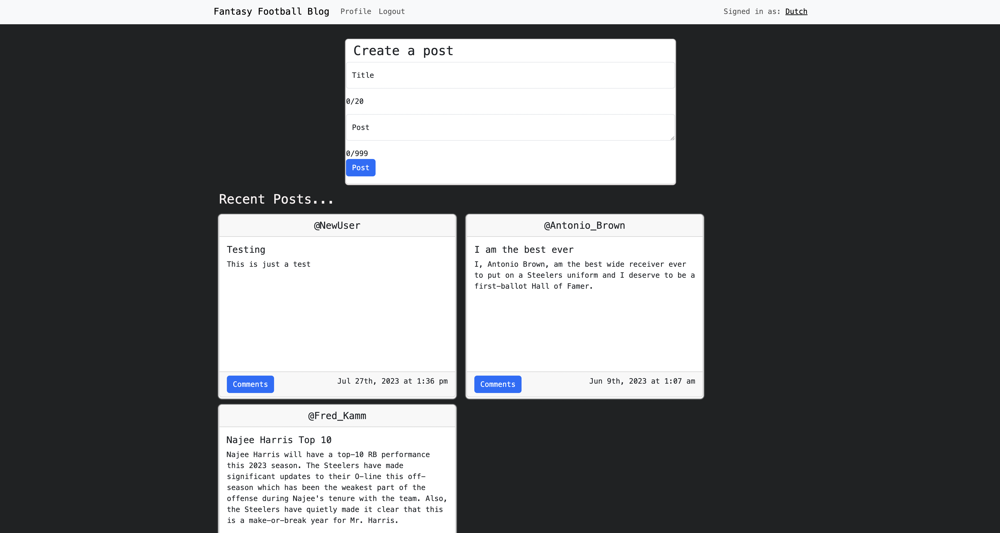

# fantasy_blog

Welcome to our professional and informative Full-Stack MERN application blog dedicated to fantasy football. To fully engage with our community, please log in or sign up to make posts or leave comments on existing posts. Our blog focuses solely on fantasy football topics, ensuring that all discussions are directly related to this exciting virtual sport.

At our blog, we strive to create a welcoming and knowledgeable environment where fantasy football enthusiasts can come together to share insights and engage in meaningful discussions. Whether you're a seasoned fantasy football veteran or just starting out, we invite you to contribute your unique perspectives to our community.

Our blog offers a wide range of resources to enhance your fantasy football experience. From expert advice and player analyses to draft strategies, trade tips, and waiver wire recommendations, we aim to provide valuable insights that will give you a competitive edge in your fantasy football leagues.

To create a post, simply log in or sign up to access the submission form. We encourage you to make your posts engaging, informative, and respectful. Share your thoughts on the latest player performances, roster strategies, game predictions, or any other fantasy football-related topic that interests you. Our community values well-reasoned arguments and constructive discussions, fostering a positive and insightful atmosphere.

Remember, fantasy football is all about having fun and enjoying the thrill of competition. Together, let's make our blog an exceptional hub for fantasy football enthusiasts.

Thank you for being a part of our fantasy football community, and we eagerly anticipate reading your posts!

# Inspiration

I am incredibly passionate about Fantasy Football, and I am excited about my aspirations to develop more applications in this field. As I embark on my first project in this area, I believe that creating a blog is an ideal opportunity to showcase my skills and knowledge of the MERN stack, as well as connect with the fantasy football community, which highly values blogs as a source of information and insights.

By focusing on professionalism, I aim to ensure that my blog stands out as a polished and credible resource. With a clean and user-friendly design, visitors will find it easy to navigate and access the content I provide.

The primary objective of my blog is to offer valuable information to fantasy football enthusiasts. I will share insights, strategies, and updates that can help readers enhance their fantasy football experience.

I value reader feedback and encourage interaction by providing a commenting system, allowing for discussions and the creation of a positive community around my blog.

# Usage

    <a href="https://fantasy-blog.onrender.com/">
        Visit my site here!
    </a>

 

    

# Tools Used

- 
- 
- 
- 
- 
- 
- 
-  --Hosting deployment

# Questions

    
Any questions or would like to collaborate Please shoot me an <a href="mailto:fred.kamm95@gmail.com"> Email </a>

    
If you would like to view more of my work  Visit my <a href="https://github.com/fredkamm ">Github</a> profile

